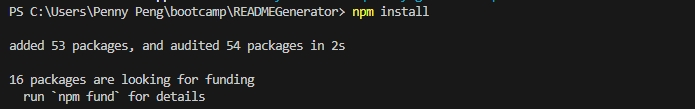
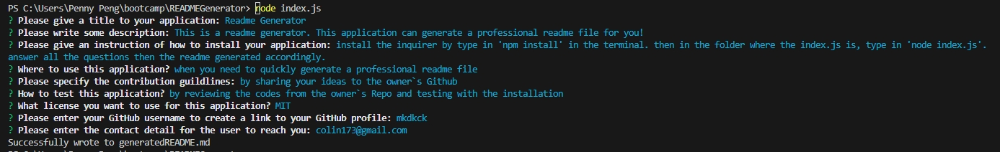
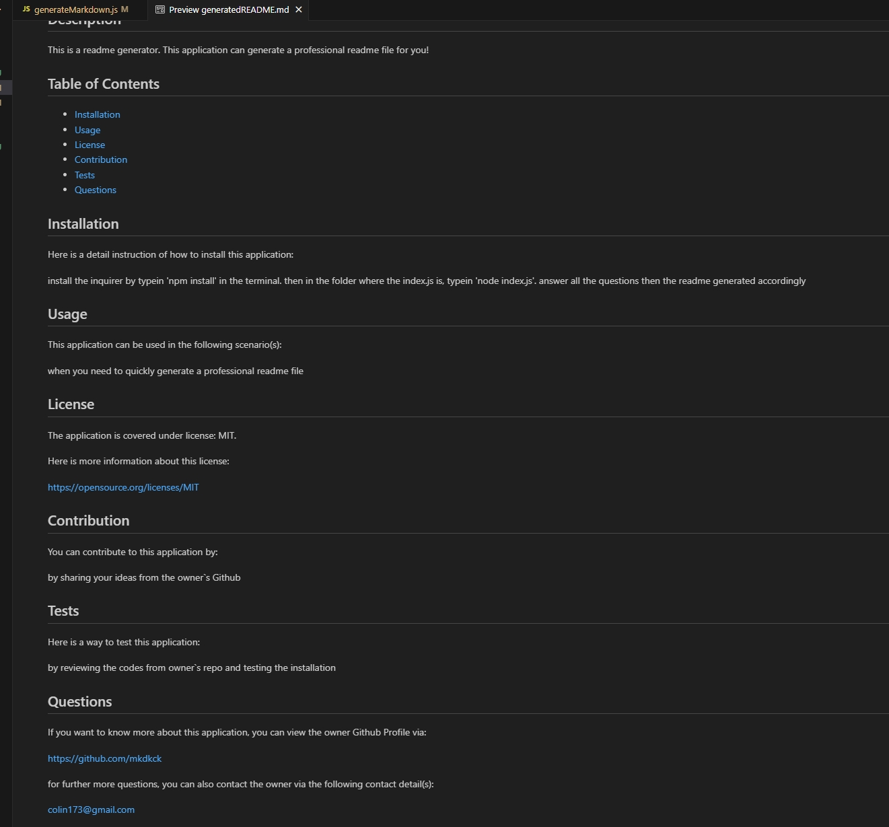

# README.md Genarator

## Description

A README.md generator which generates a professional formatted README.md in minutes.

## Table of Contents

- [Installation](#installation)
- [Usage](#usage)
- [License](#license)
- [Contribution](#contribution)
- [Test](#test)
- [Further Questions](#furtherquestions)

## Installation

Open the directory from VS Code.

1. install inquirer:

  

2. run index.js to start the generator with questions:

  

3. Readme generated with information input, and formed a nice format:

  

Here is a video tour of how to install and use the application:   
https://drive.google.com/file/d/1vqwhCYP9E23XqiR5ahtPi1Ck9JyYLGrf/view

## Usage

- to generate a professional README.md.
- after run the index.js, several questions prompted to make sure the user answer all the important questions for a quality README.
- a REAME.md is gerated after you see the successful information, a new file called generatedREADME.md is generated in the main folder.

## License

N/A

## Contribution
You can contribute to this application by revising the codes here:  
https://github.com/mkdkck/READMEGenerator

## Test
N/A

## FurtherQuestions

please review the codes here：  
https://github.com/mkdkck/READMEGenerator

or contact the owner via: colin173@gmail.com

## Badges

